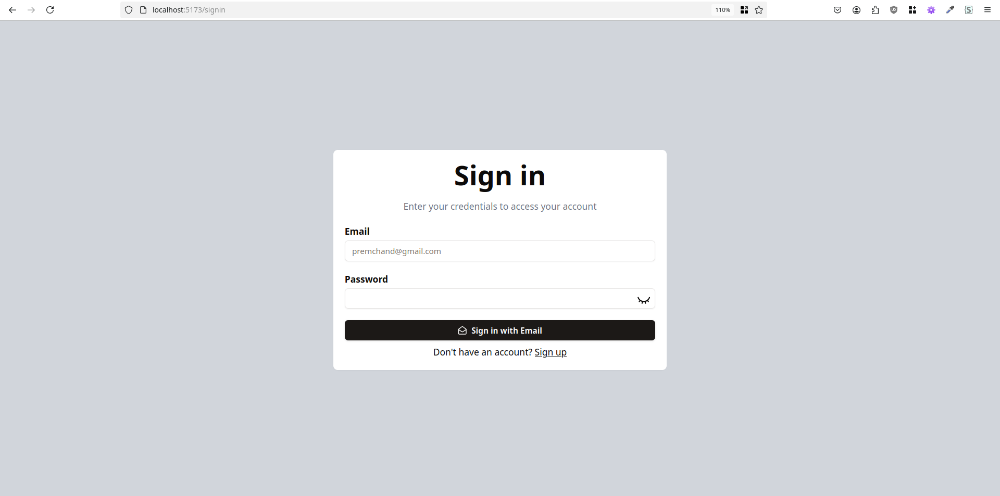

## Transactions App

So, a basic transactions app, to demonstrate the DB transactions. I used typescript in it, thus maintaining type consistencies. Any user can sign up in it, after that, the person will be accounted a random balance between ₹ 1-10000. On the dashboard, you can see all the users and find any user, to whom you want to send the money. In it I have also used the debouncer to manage the number of DB calls. In the sending money part, core DB transactions are used which will rollback if any of the DB query fails. I have also used the appropriate routing, thus a logged in person won't be able to see login or sign up page and a logged out person would not be able to see dashboard or send money page. On the root page if you click on signup or singin button and you are already logged in than you'll automatically be redirected to dashboard page. The logout option is given in a popup menu which appears on clicking on the avatar on top right corner of the dashboard page.

**Root page**

**dashboard page**

**Sign up page**

**Sign in page**

**Money transfer page**

